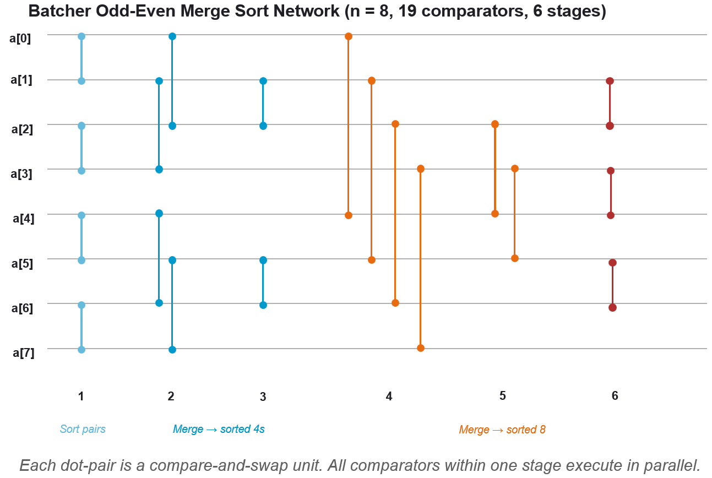

# HDMI Stream Cartoonized-Effects Accelerator on FPGA

Real-time video cartoonization pipeline implemented as an FPGA hardware accelerator using High-Level Synthesis (HLS), targeting the PYNQ-Z2 board with live 720p60 HDMI streaming.

> **Course:** CESE4090 — Reconfigurable Computing Design, TU Delft  
> **Authors:** Shanghong Lin, Hugues Delsaut, Castello Leonardo (Group 8)

---

## Overview

This project implements a real-time image cartoonization effect on an FPGA. The pipeline processes a live HDMI video stream by combining **edge extraction** (via adaptive thresholding) with **edge-preserving smoothing** (via bilateral filtering) to produce a cartoon-style output at full 720p60 throughput.

The design was first prototyped as a Python/OpenCV software reference running on the ARM processor, then translated into a fully streaming C++/HLS hardware accelerator synthesized with Vitis HLS and integrated into the PYNQ-Z2 video path via Vivado.

### Pipeline Architecture

```
                        ┌─── Grayscale ─── Median Blur ─── Adaptive Threshold ───┐
HDMI In ─► Duplicate ──┤                                                         ├─► Bitwise AND ─► HDMI Out
                        └─── Bilateral Filter ───────────────────────────────────┘
```

The upper (edge) branch converts each frame to grayscale, suppresses impulse noise with a 5×5 median filter, and extracts edges using local-mean adaptive thresholding. The lower (color) branch smooths the original frame with a 5×5 bilateral filter. A bitwise AND fuses the binary edge mask with the smoothed color image to produce the final cartoon effect.

## Key Results

| Metric | Software (ARM CPU) | Hardware (FPGA) |
|---|---|---|
| Frame processing time | 740 ms (1.35 FPS) | 4.71 ms (212 FPS) |
| Speedup | — | **~157×** |
| Max clock frequency | — | 195.7 MHz |
| Pipeline latency | — | 36 cycles |
| Initiation interval | — | 1 cycle/pixel |

The hardware accelerator comfortably exceeds the 60 FPS real-time requirement, with output quality visually indistinguishable from the software reference.

### FPGA Resource Utilization (Cartoonize IP only)

| Module | LUTs | FFs | BRAMs | DSPs |
|---|---|---|---|---|
| Total Pipeline | 10,889 | 11,091 | 62 | 45 |
| Bilateral Filter | 4,623 | 6,513 | 30 | 42 |
| Median Blur | 4,291 | 2,347 | 4 | 0 |
| Adaptive Threshold | 952 | 727 | 4 | 1 |
| Grayscale + Others | 455 | 264 | 24 | 2 |

## Directory Structure

- `hls/` : Vitis HLS C/C++ source for the FPGA accelerator, including the top-level pipeline, median blur, adaptive threshold, bilateral filter, pixel type definitions, and precomputed LUTs.
  - `tb/` : Vitis HLS testbenches for the pipeline components.

- `param_calc/` : Offline parameter computation scripts that generate fixed-point Gaussian kernels, range LUTs, and reciprocal tables used by the HLS bilateral filter.

- `py_hls_algorithm_verification/` : Python testbenches that mirror the HLS algorithms for bit-accurate verification, including validation of the Batcher odd-even merge sorting network.

- `py_openCV/` : Software reference implementation in Python with OpenCV, including the cartoonization pipeline, parameter sweeps for adaptive threshold tuning, and timing benchmarks.


## Technical Highlights

### SW–HW Co-Design Optimizations

**Median Filter — Batcher's Odd-Even Merge Sort:** The software median uses standard library sorting, but the hardware implementation employs a fully unrolled Batcher's odd-even merge sorting network of compare-and-swap operations. The 25-element window is padded to 32 elements (next power of two), and the entire sort is synthesized as a fixed, data-independent comparator network with deterministic latency — no branching required. The following figure shows the process to sort 8-element sequence as example.


The fundamental unit is a branchless compare-and-swap macro (`hls/median_blur.h`):

```cpp
#define CMP_SWAP(arr, i, j) \
    do { \
        if (arr[i] > arr[j]) { \
            uint8_t t = arr[i]; arr[i] = arr[j]; arr[j] = t; \
        } \
    } while(0)
```

The network itself (`batcher_sort_32` in `hls/median_blur.h`) consists of 191 comparators across 5 merge phases — for example, Phase 1 sorts all adjacent pairs in parallel:

```cpp
// PHASE 1: Sort adjacent pairs (16 comparators, all independent)
CMP_SWAP(arr,0,1);   CMP_SWAP(arr,2,3);   CMP_SWAP(arr,4,5);   CMP_SWAP(arr,6,7);
CMP_SWAP(arr,8,9);   CMP_SWAP(arr,10,11); CMP_SWAP(arr,12,13); CMP_SWAP(arr,14,15);
CMP_SWAP(arr,16,17); CMP_SWAP(arr,18,19); CMP_SWAP(arr,20,21); CMP_SWAP(arr,22,23);
CMP_SWAP(arr,24,25); CMP_SWAP(arr,26,27); CMP_SWAP(arr,28,29); CMP_SWAP(arr,30,31);
// ... Phases 2–5 progressively merge into 4-, 8-, 16-, and 32-element sorted sequences
```

---

**Adaptive Threshold — Sliding-Sum Reformulation:** Rather than recomputing the full 25-element sum for every pixel, the hardware uses an incremental sliding-sum approach: `S_t = S_{t-1} + new_column_sum - old_column_sum`. This reduces the steady-state computation to two additions and one subtraction per pixel, eliminating a wide adder tree from the critical path.

A column-sum shift register and running accumulator maintain the sliding window sum. The per-pixel update replaces a 25-input adder tree with two additions and one subtraction:

```cpp
// Sum the NEW column entering from the right (small K-element adder)
uint16_t new_col_sum = 0;
for (int i = 0; i < K_SIZE; i++) { new_col_sum += window_buffer[i][K_SIZE - 1]; }

// Retrieve OLD column sum leaving from the left
uint16_t old_col_sum = col_sums_buffer[0];

// Incremental update: S_t = S_{t-1} + new - old
current_window_sum = current_window_sum + new_col_sum - old_col_sum;

// Shift column sums left; insert new
for(int i = 0; i < K_SIZE - 1; i++) { col_sums_buffer[i] = col_sums_buffer[i+1]; }
col_sums_buffer[K_SIZE - 1] = new_col_sum;
```

The threshold decision then compares the center pixel against the local mean:

```cpp
uint8_t local_mean = current_window_sum / K_AREA;
uint8_t center_pixel = window_buffer[K_PAD][K_PAD];
result_pixel = ((int)center_pixel > (int)local_mean - C_CONST) ? MAX_VAL : 0;
```

---

**Bilateral Filter — Fixed-Point Arithmetic + LUT-Based Normalization:** The design uses fixed-point arithmetic throughout, with precomputed spatial Gaussian, range Gaussian (exploiting symmetry for half-sized LUT), and reciprocal normalization tables — eliminating all runtime division and floating-point operations.

All weights are stored as fixed-point LUTs computed offline (`hls/04_bilateral_filter_kernels_fixed.hpp`):

```cpp
typedef ap_ufixed<16,1> weight_t;  // Fixed-point weight ∈ [0, 1)

// Precomputed 5×5 spatial Gaussian (σ_space=100)
static const weight_t SPATIAL_KERNEL_FX[5][5] = { /* ... */ };

// Range Gaussian indexed by |intensity diff| — symmetry means one-sided LUT suffices
static const weight_t COLOR_LUT_FX[256] = { /* ... */ };
```

Division-free normalization via a precomputed reciprocal table (`hls/04_bilateral_reciprocal_lut.hpp`):

```cpp
typedef ap_ufixed<18,1> recip_t;
static const recip_t RECIP_LUT[32] = {
    recip_t(1.0), recip_t(0.5), recip_t(0.333), /* ... */ recip_t(0.03125)
};
```

The core convolution loop is fully unrolled over 25 taps × 3 channels (`hls/04_bilateral_filter_hls.cpp`):

```cpp
for (int c = 0; c < 3; c++) {          // R, G, B in parallel
    #pragma HLS UNROLL
    wsum_t w_sum = 0;  vsum_t val_sum = 0;
    for (int i = 0; i < D; i++) {
        for (int j = 0; j < D; j++) {  // 25 taps, fully unrolled
            #pragma HLS UNROLL
            int diff_abs = /* branchless |neighbor - center| */;
            weight_t w = SPATIAL_KERNEL_FX[i][j] * COLOR_LUT_FX[diff_abs];
            w_sum   += w;
            val_sum += w * neighbor_val;
        }
    }
    // Normalize: multiply by reciprocal instead of dividing
    recip_t inv_w = RECIP_LUT[quantize(w_sum)];
    result_pixel.val[c] = clamp(val_sum * inv_w, 0, 255);
}
```

---

### Streaming Architecture

All filter stages use a **line buffer + window buffer** architecture for one-pixel-per-cycle throughput. Key design choices include edge replication for border handling, cyclic line buffer indexing (avoiding modulo operations), and TUSER-based frame synchronization with automatic state reset.

TUSER-based frame sync resets all state on a new frame; a cyclic counter replaces modulo for line indexing:

```cpp
if (p_in.user) { x = 0; y = 0; cnt = 0; }       // Frame reset via TUSER
if (p_in.last) { x = 0; y++; cnt++; if (cnt >= K_SIZE-1) cnt = 0; }  // Row advance + cyclic wrap
```

Edge replication is used for the top and left border for the initial cycles before the line buffer is fully populated. See this interactive [demo for visualization](hls/improvements/Gemini_median_blur_visual.html) (open the HTML file locally in your browser).

---

### Mode-Selectable Pipeline

A debug/demo variant (see branch `select_mode`) supports runtime output selection via AXI-Lite register writes, allowing visualization of each intermediate stage (passthrough, bilateral only, grayscale, median blur, edge mask, full cartoon) without resynthesis.

## Prerequisites

- **Hardware:** PYNQ-Z2 board, HDMI source (PC/laptop), HDMI monitor
- **Software:** Xilinx Vitis HLS 2023.1+, Vivado 2023.1+
- **Python:** OpenCV (`cv2`), NumPy (for software reference)

## Getting Started

1. **Software reference:** Run the Python pipeline on any machine with OpenCV to explore parameters and verify the algorithm.

2. **HLS synthesis:** Open the Vitis HLS project, synthesize `cartoonize_pipeline` with a 7 ns clock target, and export the IP.

3. **Vivado integration:** Import the HLS IP into the PYNQ base overlay block design. Connect the AXI-Stream ports between `hdmi_in` and `axi_vdma`, tie clocks to the 142 MHz video domain, and generate the bitstream.

4. **Deploy:** Copy the `.bit` and `.hwh` files to the PYNQ board, open the Jupyter notebook, load the overlay, and start the HDMI video loop.

## Target Platform

| Specification | Value |
|---|---|
| Board | PYNQ-Z2 (Xilinx Zynq XC7Z020) |
| Resolution | 1280 × 720 @ 60 Hz |
| Video clock | 142 MHz |
| Available LUTs | 53,200 |
| Available FFs | 106,400 |
| Available BRAMs | 140 |
| Available DSPs | 220 |

## References

1. OpenCV Documentation — [Image Thresholding](https://docs.opencv.org/4.x/d7/d4d/tutorial_py_thresholding.html)
2. Bradley, D. and Roth, G. (2007). [*Adaptive thresholding using the integral image.*](https://doi.org/10.1080/2151237X.2007.10129236) Journal of Graphics Tools, 12(2):13–21.
3. Datahacker.rs — [How to Cartoonize an Image with OpenCV in Python](https://datahacker.rs/002-opencv-projects-how-to-cartoonize-an-image-with-opencv-in-python/)
4. Paris, S. et al. (2009). [*Bilateral Filtering: Theory and Application.*](https://people.csail.mit.edu/sparis/bf_course/course_notes.pdf) MIT Course Notes.
5. Sauvola, J. and Pietikäinen, M. (2000). Adaptive document image binarization. *Pattern Recognition*, 33(2):225–236.
6. TUL Corporation (2018). [PYNQ-Z2 User Manual.](https://www.mouser.com/datasheet/2/744/pynqz2_user_manual_v1_0-1525725.pdf)
7. Lang, H.W. — [Batcher's Odd-Even Merge Sort Networking](https://hwlang.de/algorithmen/sortieren/networks/oemen.htm)